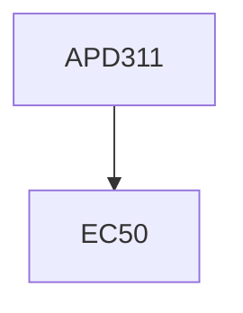

**Credits:** 4 (0-0-8)

**Prerequisites:** EC 50, 12 Credits of Minor Area in Computational Mechanics

#### Description
No description available.

### Prerequisite Tree

```mermaid
flowchart TD
APD311-1267[APD311]
APD311-1267 --> EC50-1267[EC50]

classDef empty height:17px, fill:transparent, stroke:transparent;
classDef trueEmpty height:0px, width:0px;
```