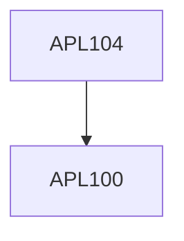

**Credits:** 4 (3-1-0)

**Prerequisites:** [[/Applied Mechanics/APL100|APL100]]

**Overlaps with:** APL105, APL108

#### Description
Introduction, State of stress at a point, equations of motion, principal stress, maximum shear stress. Concept of strain, strain displacement relations, compatibility conditions, principal strains, transformation of stress/strain tensor, state of plane stress/strain. Constitutive relations, uniaxial tension test, idealized stress-strain diagrams, isotropic linear elastic, viscoelastic and elasto-plastic materials. Energy Methods. Uniaxial stress and strain analysis of bars, thermal stresses, Torsion, Bending and shear stresses in beams, deflection of beams, stability of equilibrium configuration.

### Prerequisite Tree

