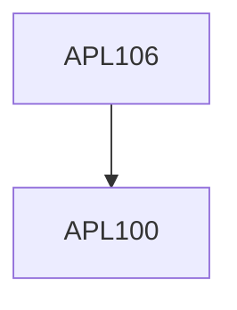

**Credits:** 4 (3-1-0)

**Prerequisites:** [[/Applied Mechanics/APL100|APL100]]

**Overlaps with:** APL107, APL105

#### Description
Introduction to Fluids and the concept of viscosity, Flow visualization, Fluid Statics, Physical laws for a control volume including continuity, momentum and energy equations, Bernoulli equation, Differential equations of fluid motion, Navier Stokes equations, vorticity and potential flows, dimensional analysis and similitude, Boundary layer theory, 1-D compressible flow.

### Prerequisite Tree

