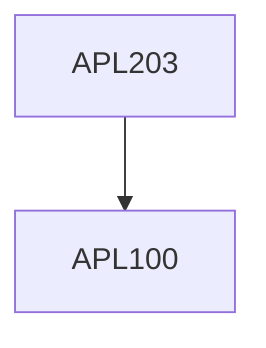

**Credits:** 4 (3-1-0)

**Prerequisites:** [[/Applied Mechanics/APL100|APL100]]

**Overlaps with:** MCL111, MCL731

#### Description
Principles of Dynamics: Newton's laws and d'Alembert's principle;

Energy methods; Generalized Dynamics: Kinematics and Kinetics, Kane's Equations and Lagrange's Equations. Introduction to Vibration with examples; Stability; Balancing; Cams and Gears; Introduction to Multibody Dynamics; Robot Dynamics; Application with Biosystems; Human Body Dynamics.

### Prerequisite Tree

