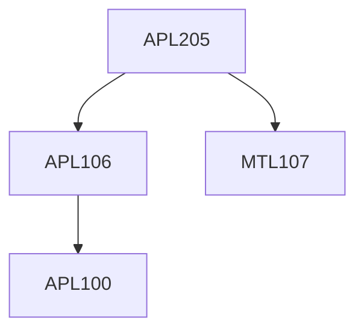

**Credits:** 2 (2-0-0)

**Prerequisites:** [[/Applied Mechanics/APL106|APL106]] or equivalent, [[/Mathematics/MTL107|MTL107]]

#### Description
Principles of computer aided design, Computer graphics fundamentals, 2D and3DTransformationsand projections, Plane Curves, Space Curves, Synthetic curves. Analytical and parametric surfaces, Synthetic surfaces, Solid Modeling basics, Solid modeling techniques and schemes, Half-spaces, Boundary Representation (B-rep), Constructive Solid Geometry (CSG), Sweep Modeling, Analytical Solid Modeling, Visual Realism, hidden line sand surface.

### Prerequisite Tree

