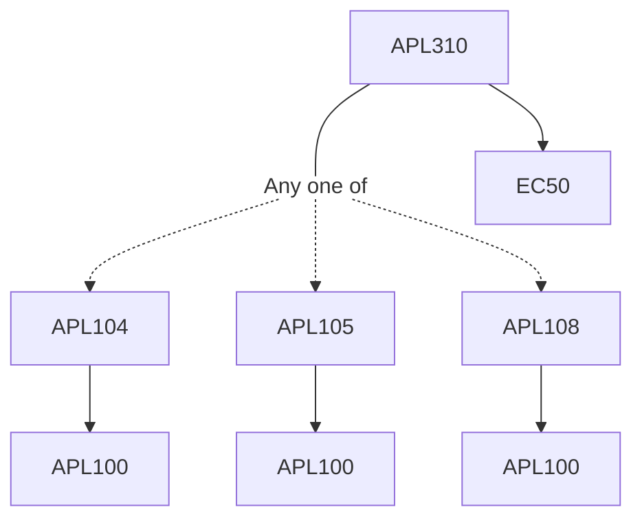

**Credits:** 4 (3-0-2)

**Prerequisites:** [[/Applied Mechanics/APL104 | APL104]]/[[/Applied Mechanics/APL105 | APL105]]/[[/Applied Mechanics/APL108 | APL108]] EC 50

#### Description 
Mathematical Preliminaries (scalar, vector, tensor operation) Thermodynamics (thermodynamical framework for constitutive modeling), Kinematics of Deformation & Motion, Stree-strain principles, Elasticity, Anisotropy, viscoelasticity, multi-physical coupling effect, plasticity, viscoplasticity. Experimental: Experimental characterization, data analysis, Model fitting.

### Prerequisite Tree

