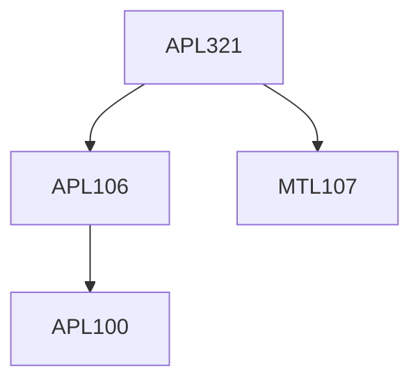

**Credits:** 4 (3-0-2)

**Prerequisites:** [[/Applied Mechanics/APL106|APL106]] or equivalent, [[/Mathematics/MTL107|MTL107]]

**Overlaps with:** APL720, CLL768, MCL813

#### Description
Review of governing equations for fluid flow, finite difference and finite volume method and its application to steady 1-D, 2-D and 3-D convection-diffusion problems, extension of FVM to unsteady 1-D, 2-D and 3-D convection diffusion problems, solution of discretized Navier Stokes equations and boundary conditions, physical description of turbulence, Reynolds-Averaged Navier-Stokes equations, closure problem; RANS based turbulence models; introduction to DNS and LES.

### Prerequisite Tree

