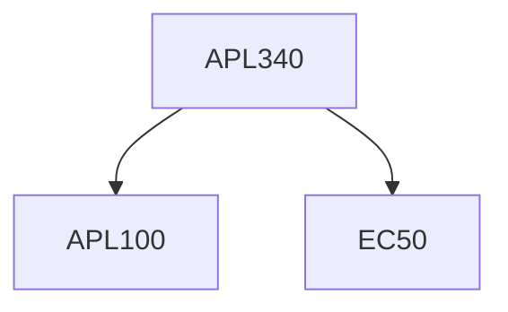

**Credits:** 4 (3-1-0)

**Prerequisites:** [[/Applied Mechanics/APL100|APL100]] and EC 50

#### Description
Introduction to linear systems and its classification, Fixed point and stability, linear stability analysis, Linearization of nonlinear systems, Types of bifurcation and examples, imperfect bifurcations and catastrophes, Coupled oscillators and quasiperiodicity, Poincare Maps, Introduction to Chaos, Lorenz equation, one-dimensional map, fractals.

### Prerequisite Tree

