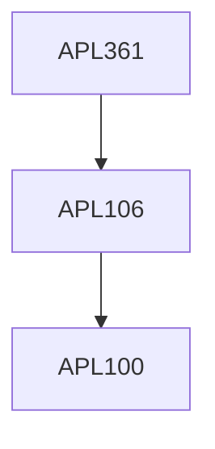

**Credits:** 3 (3-0-0)

**Prerequisites:** [[/Applied Mechanics/APL106|APL106]] or equivalent

**Overlaps with:** APL360, APL711, APL715, MCL702

#### Description
Derivation of Navier-Stokes (NS) equations; Boundary-conditions and Exact/Similarity solutions. General Boundary-Layer assumption; Free- shear flows; Separation and drag crisis. Low Reynolds Number flows: Stokes Flow; Oseen’s Correction; Lubrication Theory. Hydrodynamic Stability Theory: Capillary Instability; Orr-Sommerfeld Equation; Squire’s Theorem; Turbulence: Nature of turbulence; Averaging and scales; Reynolds decomposition and the closure problem; Kolmogorov hypotheses and microscales; Reynolds stress; eddy viscosity vs. molecular viscosity. Dynamics of turbulence; balance of kinetic energy, vorticity dynamics, scalar dispersion. Statistics; convergence of averages; correlations and probability density functions. Turbulent shear flows.

### Prerequisite Tree

