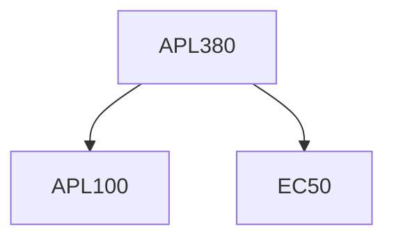

**Credits:** 3 (3-0-0)

**Prerequisites:** [[/Applied Mechanics/APL100|APL100]] and EC 50

#### Description
Basics of rigid body mechanics, solid mechanics, and fluid mechanics applied in biological system; Basic introduction to anatomy and physiology; Mechanics of Human Motion; Mechanics of response of tissues including bones; Mechanics of Blood flow, Biosolid- fluid interaction.

Computer Lab contents: Matlab Programming basics, Image processing basics, Design of Joint: Rigid Body Mechanics based approach, Matlab programming for bone or Aortic Tissue; Matlab programming for blood flow analysis.

### Prerequisite Tree

