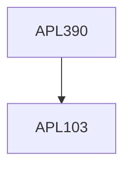

**Credits:** 3.5 (2-0-3)

**Prerequisites:** [[/Applied Mechanics/APL103|APL103]]

#### Description
Review of errors in measurements and other statistical concepts related to errors and their combinations, and probability distributions. Advanced techniques in fluid flow: Hot wire Anemometry, Laser Doppler Velocimetry and particle sizing, particle Image Velocimetry, Volumetric methods: Tomo PIV and background oriented Schlieren, Derived Quantities from PIV: Vorticity, strain rate and pressure. Applications related to Strain gauges, Clip gauges, Piezoelectric sensors, and Ultrasonic sensors. Coherent gradient sensing (CGS). 2D Digital image correlation (DIC) for full field measurements. Moire fringe methods. Particle image velocimetry (PIV). Hardness testing of the common engineering materials. Characterization of solids under compression, tension and shear. Fatigue and Creep testing. Drop tower. Modal analysis and structural vibrations. Sound absorption characterization of the material.

### Prerequisite Tree

