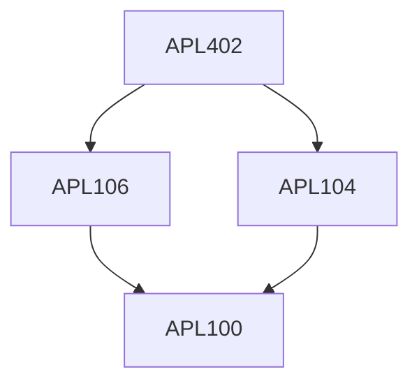

**Credits:** 3 (3-0-0)

**Prerequisites:** [[/Applied Mechanics/APL104|APL104]] or equivalent, [[/Applied Mechanics/APL106|APL106]] or equivalent

#### Description
Introduction, Flow separation, Vortex shedding, Basics of vibration, Spring-mass system, Free and forced vibration, Dimensional analysis, Coupled equations of fluid and structure, Dimensionless coupled equation, Dimensionless numbers in FSI, Added mass. Vortex induced vibrations, Wake oscillator model, Galloping, Vibration induced in pipes by external and internal axial flow, sloshing, Dynamics of continuous solid and fluid systems, Waves and vibrations in FSI, basics of acoustics. Computational techniques for FSI solvers: Monolithic vs partitioned approach, One-way/explicit vs two-way/implicit coupling, accuracy, and stability criterion.

### Prerequisite Tree

