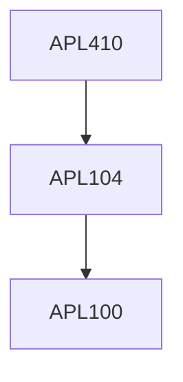

**Credits:** 3 (3-0-0)

**Prerequisites:** [[/Applied Mechanics/APL104 | APL104]] or equivalent course in Basic Solid Mechanics

#### Description 
Introduction to multiscale modeling; Bridging nano, micro and macro scale in materials; Basic equations of continuum mechanics; Micromechanical homogenization theory: Ergodicity principle, representative volume element, periodic boundary conditions, eigenstrain, eigenstress, inclusions; Effective elastic modulus: self-consistent method, Mori-Tanaka method, Eshelby method, Multi-inclusions problems; Voigt and Reuss bound; Hashin- shtrikmanvariational principles; Micromechanical damage theory; Micromechanics of phase transformation in solids; Nanomechanics: Linear atomic chains, two and three dimensional lattices, Molecular mechanics, Cauchy-Born rule.

### Prerequisite Tree

