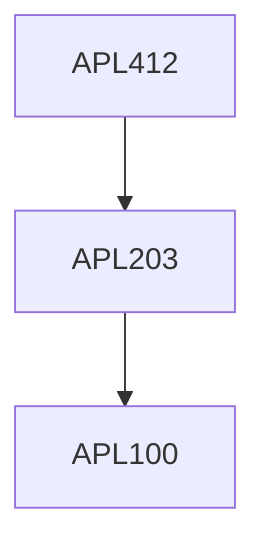

**Credits:** 3 (3-0-0)

**Prerequisites:** [[/Applied Mechanics/APL203 | APL203]]

**Overlaps with:** MCL738

#### Description 
Kinematics, Angular velocity, Frame, Composition of velocities, Euler Newton formulation of equations of motion. Energy based formulation of Equations of motion (Hamiltonian and Lagrangian). Constraints equations (2D & 3D) and Actuators System level multibody equation formulation for 2D examples. Numerical integration of the E.O.M. of the system (2D). Orientation parameterization: Euler angles, Euler parameters, Quaternions etc. Examples of 3D rigid multibody systems. Intro to flexible-multibody systems (governing equations etc).

### Prerequisite Tree

