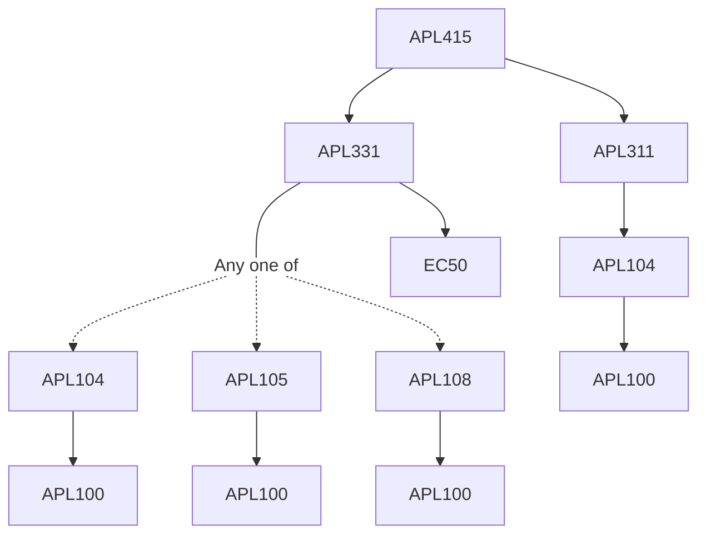

**Credits:** 3 (3-0-0)

**Prerequisites:** [[/Applied Mechanics/APL311|APL311]], [[/Applied Mechanics/APL331|APL331]]

**Overlaps with:** APL835

#### Description
Composites, Various reinforcement and matrix materials, Strength and stiffness properties, Effective moduli, Spherical inclusions, Bio- composites, cylindrical and lamellar systems, Laminates: Laminated plates, Analysis and Design with composites, Fiber reinforced pressure vessels, dynamic, inelastic and non-linear effects, Fabrication of composites, Machining of composites, Strength evaluation, Technological applications.

### Prerequisite Tree

