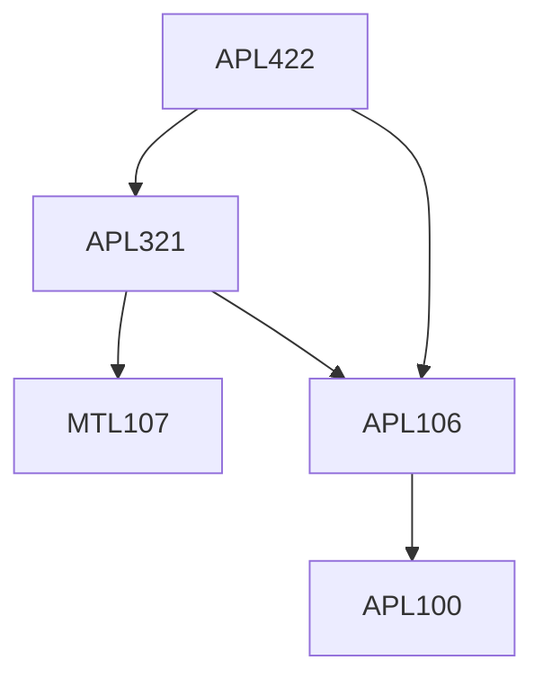

**Credits:** 3 (2-0-2)

**Prerequisites:** [[/Applied Mechanics/APL106|APL106]] or equivalent, [[/Applied Mechanics/APL321|APL321]]

**Overlaps with:** APL720, CLL768, MCL813

#### Description
Introduction to numerical methods, mesh generation and mesh adaptivity, spectral methods and applications to fluid simulations, discrete and fast Fourier transforms, Chebyshev polynomials, Gibbs phenomena, spectral discretization methods for diffusion and convection-diffusion problems, staggered and collocated grids, pressure velocity coupling, predictor corrector method multigrid method.

### Prerequisite Tree

