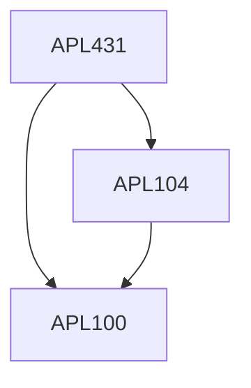

**Credits:** 3 (3-0-0)

**Prerequisites:** [[/Applied Mechanics/APL100|APL100]], [[/Applied Mechanics/APL104|APL104]]

#### Description
Introduction to elasticity and aerospace structures Loads on aerospace structures, Beams, Truss and Frame Torsion of noncircular prismatic bars. Curved beams. Stability of structures. Theory of Thin-walled beams, Open and closed cross-section, Torsion and bending of thin-walled beams. Normal stresses and shear flows, shear Centre, bending and torsional stability. Energy and variational based numerical methods.

### Prerequisite Tree

