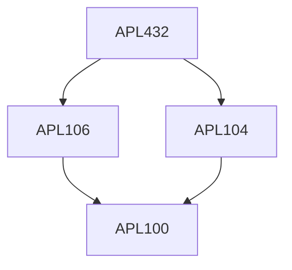

**Credits:** 3 (3-0-0)

**Prerequisites:** [[/Applied Mechanics/APL104|APL104]], [[/Applied Mechanics/APL106|APL106]]

#### Description
Introduction to aeroelasticity and aeroelastic phenomena, Static and dynamic aeroelastic phenomena using simplified aerodynamic and structural models, 1-Daeroelastic model of airfoil, Divergence of 2-D airfoil and straight wing, Wing loading and deformations, Flutter model of 2-D airfoil, Unsteady aerodynamics, 2-D and 3-D supersonic flow, Subsonic flow, Theodorsen theory, Flutter calculation, Exact treatment of bending – torsion, Flutter of uniform wing, Flutter analysis by assumed mode method, Panel flutter, Numerical aeroelastic calculations using software.

### Prerequisite Tree

