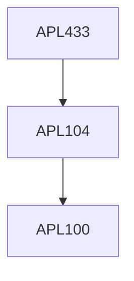

**Credits:** 3 (3-0-0)

**Prerequisites:** [[/Applied Mechanics/APL104|APL104]]

**Overlaps with:** APL831, CVL858

#### Description
Basic assumptions of two-dimensional (surface) theories Theory of thin plates, bending of rectangular and circular plates, shear deformation theories. General theory of curved shells, Axi-symmetric problems of cylindrical, conical and spherical shells and pressure vessels, membrane problems of cylindrical, spherical and conical shells. Energy methods, Design considerations.

### Prerequisite Tree

