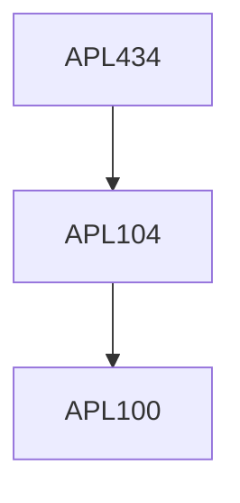

**Credits:** 3 (3-0-0)

**Prerequisites:** [[/Applied Mechanics/APL104|APL104]]

**Overlaps with:** CVL864

#### Description
Introduction to Smart Material Systems; Overview of smart materials, Modeling mechanical, thermal and electrical systems (thermo mechanics and electrostatics);Piezoelectric materials: constitutive modelling, piezoelectric beam static and vibration analysis Shape memory alloys (SMA): constitutive modelling, actuation models for SMA, electrical actuation Brief overview of Electroactive Polymers, Magnetostrictive materials, Electro and Magneto Rheological Fluids Mechanics of smart composite structures Transducer applications: Vibration control and damping using piezoelectric materials. Case study: Sensing and control of Smart beams and plates.

### Prerequisite Tree

