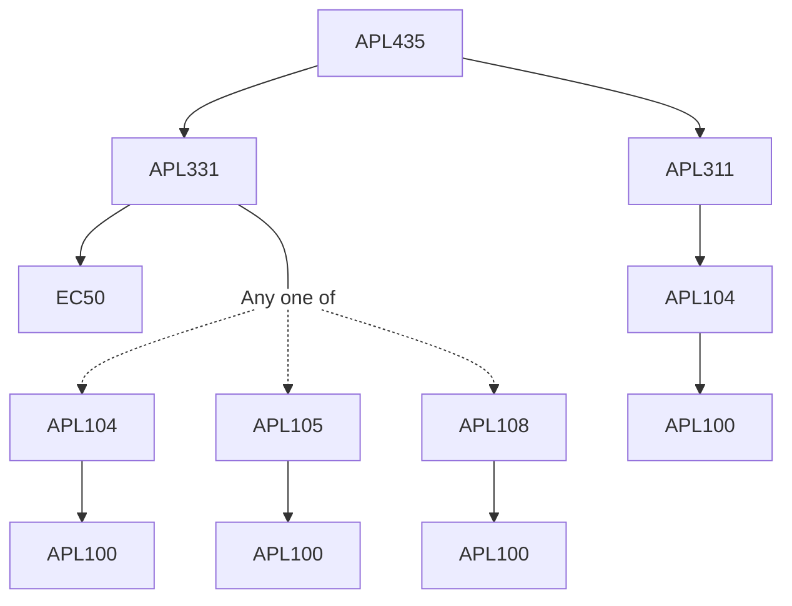

**Credits:** 3 (3-0-0)

**Prerequisites:** [[/Applied Mechanics/APL311|APL311]], [[/Applied Mechanics/APL331|APL331]]

#### Description
Rigid body impact, Stress waves in solids, Applications of one dimensional stress wave theory. Reflection at boundaries and interface, Waves in infinite and semi-infinite medium, Plasticity and Plastic Waves, Shock waves and Equation of State, Material Characterization and Impact Tests, Computational Methods for Impact, Applications to Ballistic Impact and Vehicle Collision.

### Prerequisite Tree

