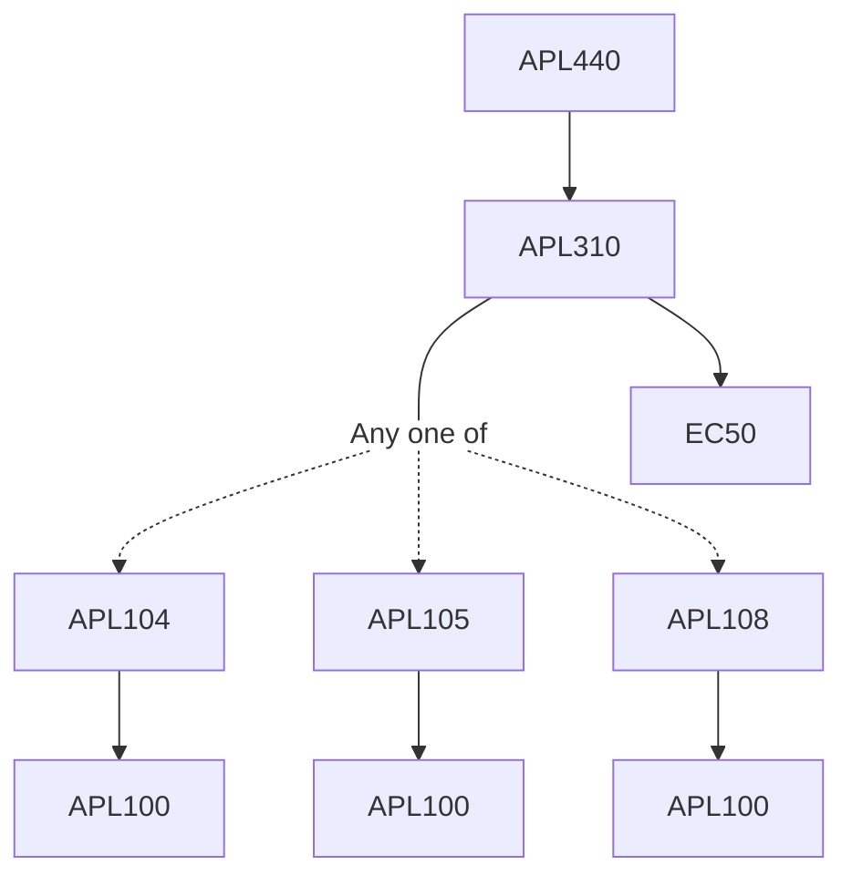

**Credits:** 4 (3-0-2)

**Prerequisites:** [[/Applied Mechanics/APL310|APL310]]

#### Description
Introduction to multi-processor, multi-core, multi-threaded processing and their clusters, GPUs and CUDA programing, Introduction to parallel processing hardware and software, Open MP, MPI, MPICH, HPC / Clustering tools and software suits.

Exploring parallelism in solid/fluid mechanics problems and formulation of numerical methods, Partitioning and divide-and- conquer strategies, Parallel algorithms for solving dynamical and non-linear systems, Finite difference and Finite element analysis of plate and shells, Finite elements in fluids, Reduced integration patch test, Dynamic FE analysis, Geometrically nonlinear problems, Material nonlinearity, Automated mesh generation, Pre and post processing, Solid fluid interaction problems, Efficient solution technique-PCG, Domain decomposition, Point source method, Boundary element method, Aero elastic flutter, Other special topics.

### Prerequisite Tree

