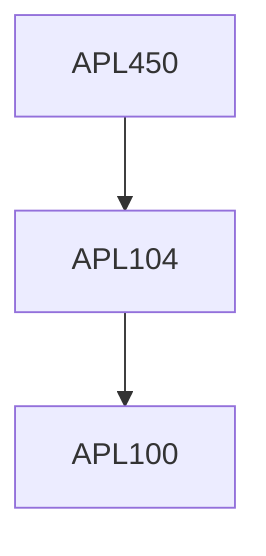

**Credits:** 3 (3-0-0)

**Prerequisites:** [[/Applied Mechanics/APL104|APL104]] or equivalent

#### Description
Soft robots vs Rigid robots, manufacturing techniques of multifunctional soft robot devices: Modeling soft mechanics (numerical, computational, analytical), Introduction to morphological simulation: Soft actuators (Dielectric, pneumatic, fluidics): Soft sensors (Fluidic, solid, composites, textiles): Soft logic (controllers, semiconducting polymer, thin film silicon):Soft energy (thermodynamics, soft batteries, soft combustion) Applications (wearable robotics, space robotics, deep- sea robotics).

### Prerequisite Tree

