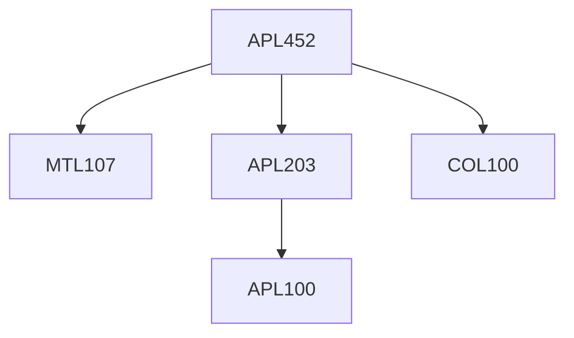

**Credits:** 3 (2-0-2)

**Prerequisites:** [[/Mathematics/MTL107|MTL107]], [[/Applied Mechanics/APL203|APL203]], [[/Computer Science and Engineering/COL100|COL100]]

#### Description
Introduction to Digital Twins and establishing the need for Computational Tools in modern engineering. First Principles Modelling using numerical solutions of ODEs and PDEs, Simulation of Dynamic systems in the Time-domain using Block-domain methods & Physical Modelling using Lagrangian Methods. Data-driven Modelling: Data Handling, Filtering and pre-processing, Visualization and Classification, Fitting classification models to data. Case Study or Project.

### Prerequisite Tree

