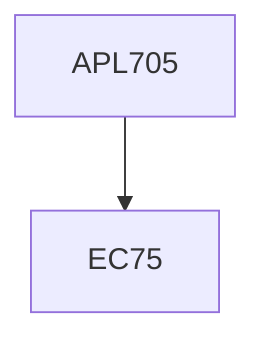

**Credits:** 4 (3-0-2)

**Prerequisites:** EC 75

#### Description
Strong and weak forms of governing differential equations, and their equivalence, Weighted residual and variational approaches. Ritz method. Discretization of weak form and boundary conditions. Convergence. Bar and beam elements. Truss and frame problems, Isoparametric formulation. Plane strain, plane stress and axi- symmetric problems, 3D elasticity problems, one and two dimensional heat transfer. Formulation of dynamics problems. Laboratory work on solid mechanics and heat transfer problems.

### Prerequisite Tree

