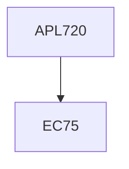

**Credits:** 4 (3-0-2)

**Prerequisites:** EC 75

#### Description
Review of governing equations for fluid flow, finite volume method and its application to steady 1-D, 2-D and 3-D convection-diffusion problems, extension of FVM to unsteady 1-D, 2-D and 3-D convection diffusion problems, pressure-velocity coupling, staggered and colocated grids, solution of discretized equations, physical description of turbulence, Reynolds-Averaged Navier-Stokes equations, closure problem; RANS based turbulence models; DNS and LES.

### Prerequisite Tree

