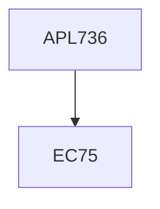

**Credits:** 4 (3-0-2)

**Prerequisites:** EC 75

#### Description
Review of continuum mechanics, material symmetry, thermodynamics and constitutive relations, symmetry in crystals, empirical and semi-empirical models of inter-atomic potential, molecular statics and dynamics, finite temperature effects in molecular systems, probabilistic behavior of material characteristics at macro scale, multiscale methods - Cauchy-Born rule and Quasi-continuum method, Mechanics of helical nanostructures (e.g., carbon nanotubes, DNA, polymers), Bending and twisting of nanotubes and nanorods.

Computer Lab contents: Programming molecular statics and molecular dynamics, molecular statics via conjugate gradient minimization and Newton-Raphson method, Monte Carlo simulation, Implementation of Cauchy-Born rule and Quasi-continuum method, Exposure to LAMMPS and AMBER.

### Prerequisite Tree

