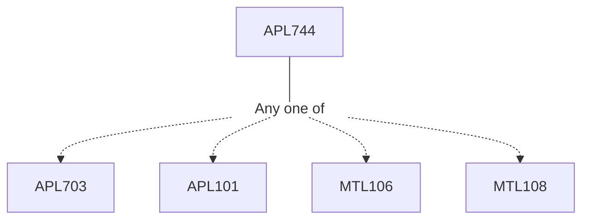

**Credits:** 4 (3-0-2)

**Prerequisites:** [[/Applied Mechanics/APL703|APL703]] / [[/Applied Mechanics/APL101|APL101]] / [[/Mathematics/MTL106|MTL106]] / [[/Mathematics/MTL108|MTL108]] or equivalent

#### Description
Review of Probability and statistics, Different probability distributions, prior, posterior, and likelihood, Maximum likelihood estimation, MAP estimate, Prior modelling, Hierarchical prior, empirical Bayes and evidence approximation, Sampling methods (Accept-reject sampling, importance sampling, Gibbs sampling, Markov chain and MH algorithm, sequential importance sampling, SMC and particle filter.

Bayesian linear regression, Probabilistic PCA, Relevance vector machine, Gaussian process, variational inference.

Application in mechanics: Feature extraction, constitutive modeling, reliability analysis and uncertainty quantification, system identification, parameter estimation, and force estimation.

### Prerequisite Tree

