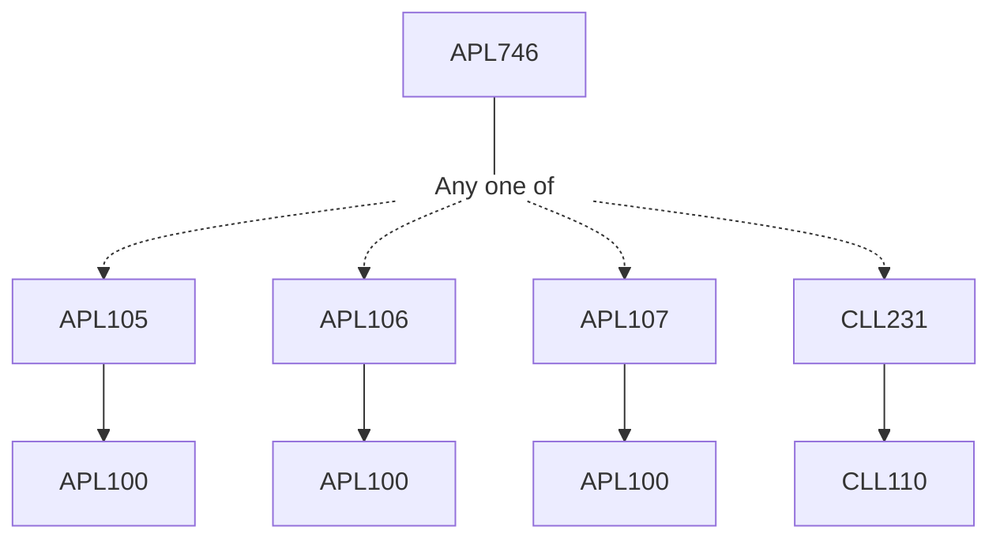

**Credits:** 3 (3-0-0)

**Prerequisites:** APLI05 / [[/Applied Mechanics/APL106 | APL106]] / [[/Applied Mechanics/APL107 | APL107]] / [[/Chemical Engineering/CLL231 | CLL231]] or equivalent

**Overlaps with:** ASL734, ASL823, ASL737

#### Description 
Course contents: Basic equations of motion in a rotating reference frame, stratification, Boussinesq and hydrostatic approximations, vorticity equation, geostrophic balance, thermal wind balance, Shallow-water equations, Surface and internal gravity waves, Kelvin- Helmholtz instability, thermal instability, barotropic and baroclinic instability, gravity currents, thermals and plumes, natural ventilation.

### Prerequisite Tree

