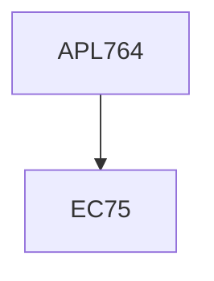

**Credits:** 3 (3-0-0)

**Prerequisites:** EC 75

#### Description
Introduction and history of biomaterials; Basic classes of engineering materials and structure property correlation; Structure and property of cells and tissues; Property requirement of biomaterials including biocompatibility, and biobegrability; Basic types of biomaterials; Mechanical testing of biomaterials; application of biomaterials (orthopedic, cardiovascular, dental) including detailed case study, Materials for biomedical devices and packaging (electronic interfacing etc.)

### Prerequisite Tree

