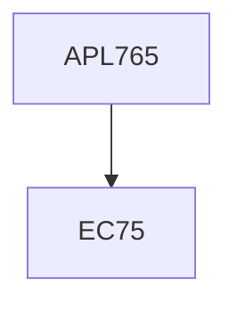

**Credits:** 3 (3-0-0)

**Prerequisites:** EC 75

#### Description
Fracture: an overview, theoretical cohesive strength, defect population in solids, stress concentration factor, notch strengthening, elements of fracture mechanics, Grifiths crack theory, stress analysis of crack, energy and stress field approaches, plane strain and plane stress fracture toughness testing, crack opening displacement, elastic- plastic analysis, J-integral, ductile-brittle transition, impact energy fracture toughness correlation, microstructural aspects of fracture toughness, environmental assisted cracking, cyclic stress and strain fatigue, fatigue crack propagation, analysis of engineering failures.

### Prerequisite Tree

