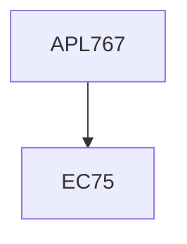

**Credits:** 3 (3-0-0)

**Prerequisites:** EC 75

#### Description
Common causes of failure, principles of failure analysis, fracture mechanics approach to failure problems, techniques of failure analysis, service failure mechanisms, ductile and brittle fracture, fatigue failure, wear failure, hydrogen induced failure, environment induced failures, high temperature failure, faulty heat treatment and design failures, processing failure (forging, casting, machining etc.), failure problems in joints and weldments, case studies for failure analysis of structural components and mechanical system.

### Prerequisite Tree

