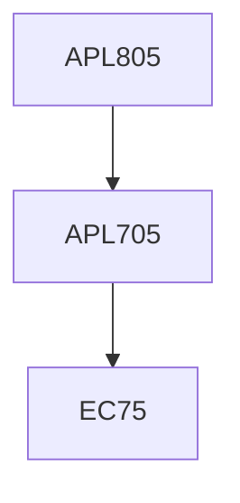

**Credits:** 3 (3-0-0)

**Prerequisites:** [[/Applied Mechanics/APL705|APL705]]

#### Description
Variational calculus; Weak formulation of governing equations and its linearization; discretization of nonlinear weak form and its solution; convergence requirement of shape functions; systematic generation of higher order elements; mixed FEM/penalty method; non-uniform and adaptive discretization – p and H convergence; solid-fluid interaction problems; Generalized and extended finite element methods.

### Prerequisite Tree

