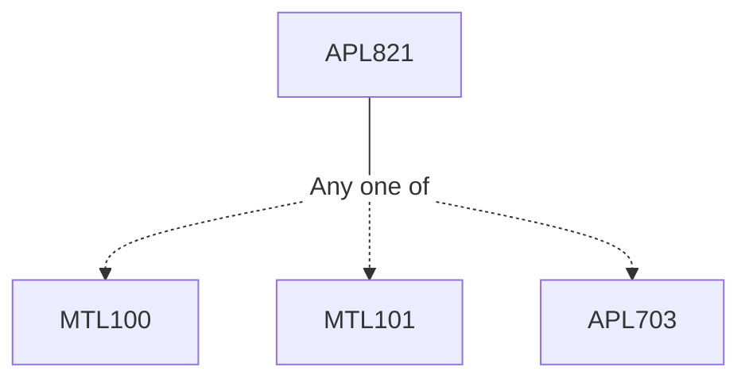

**Credits:** 4 (3-0-2)

**Prerequisites:** [[/Mathematics/MTL100|MTL100]]/[[/Mathematics/MTL101|MTL101]]/[[/Applied Mechanics/APL703|APL703]] or equivalent

#### Description
Spectral methods and application to fluid simulations, Sturm Liouville problems, polynomial approximations, discrete and fast Fourier transforms, Chebyshev polynomials, Gibbs phenomena, spectral discretization methods for diffusion and convection diffusion problems, stability and convergence properties, pseudo spectral methods, steady and unsteady Burgers equation, applications in turbulence simulations.

### Prerequisite Tree

