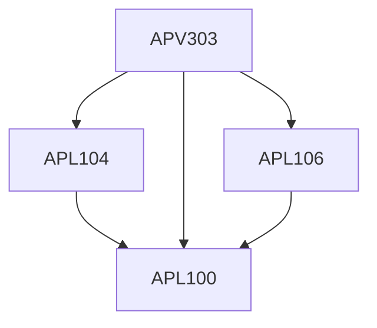

**Credits:** 1 (1-0-0)

**Prerequisites:** [[/Applied Mechanics/APL100|APL100]], [[/Applied Mechanics/APL104|APL104]], [[/Applied Mechanics/APL106|APL106]]

#### Description
Human Mechanics (shoulder Joint During Wrist-spin bowing, biceps brachii muscle during fast bowling), Fluid Mechanics (Conventional and reverse swing bowling), Structure and mechan-ical properties of cricket ball and bat, Solid Mechanics (oblique impact of ball on pitch and ball on bat).

### Prerequisite Tree

