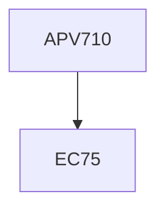

**Credits:** 1 (1-0-0)

**Prerequisites:** EC 75

#### Description
Introduction to the concept of natural units; dimensional analysis; method of scale factors; non-dimensionalization of governing equations and boundary conditions; self-similarity; relaxation of modelling requirements; introduction to the theory of approximations; singular approximations and boundary layers; case studies from diverse fields.

### Prerequisite Tree

