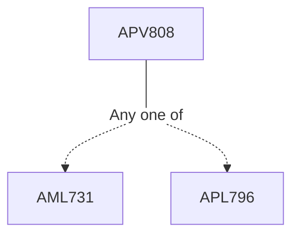

**Credits:** 1 Credit (1-0-0)

**Prerequisites:** [[/Applied Mechanics/AML731|AML731]] or [[/Applied Mechanics/APL796|APL796]] or an equivalent course in Linear Elasticity

#### Description
Plane Contacts: Surface traction, interior stress fields, partial slip rough contacts, numerical techniques.

### Prerequisite Tree

