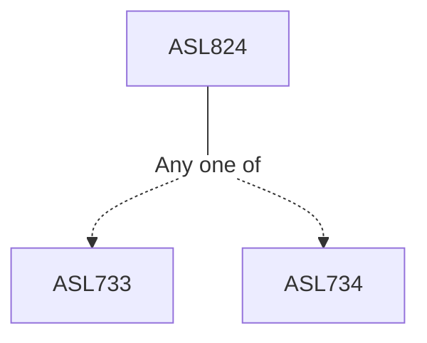

**Credits:** 3 (3-0-0)

**Prerequisites:** Any one of [[/Atmospheric Sciences/ASL733|ASL733]], [[/Atmospheric Sciences/ASL734|ASL734]]

#### Description
A simple model of atmosphere with Rayleigh friction and Newtonian cooling: Gill’s analytical solutions for heat-induced tropical circulations (especially El Niño and monsoon circulation); horizontal diffusion in NWP models: prevention of accumulation of small scale noise, inverse cascade. Aerodynamic formulae for surface turbulent fluxes, vertical turbulent diffusion: one-dimensional PBL model. Parameterization of orographic drag. Dry and moist processes in the atmosphere: a simple model of convection, dry adiabatic adjustment, large- scale condensation, and parameterization of deep and shallow convection. Simple and complex radiative transfer in the atmosphere; absorption of radiation by ozone, carbon dioxide and water vapour; shortwave and longwave radiation computation; radiative heating in the atmosphere.

### Prerequisite Tree

