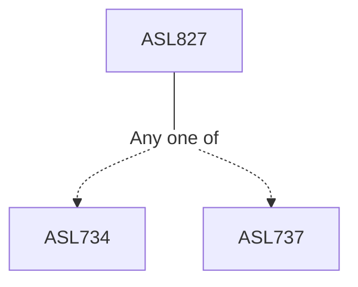

**Credits:** 3 (3-0-0)

**Prerequisites:** Either [[/Atmospheric Sciences/ASL734|ASL734]] or [[/Atmospheric Sciences/ASL737|ASL737]]

#### Description
Conservation laws for moving fluids, Ekman and Sverdrup theories, coastal upwelling and fronts, Western boundary intensification, barotropic currents, baroclinic transport over topography, thermohaline circulation, Mesoscale eddies and variability. Indian ocean circulation, wave theory, ocean wave spectra, wave energy equation, breaking waves, reflection and dissipation, theory of tides, tidal currents, tidal processes in embayment and estuaries, wind and buoyancy driven currents, near-shore circulation, alongshore currents, wave-current interaction, sediment transport, coastal ocean response to extreme wind forcing, storm surges, Planetary and equatorial waves, coastally trapped Kelvin waves.

### Prerequisite Tree

