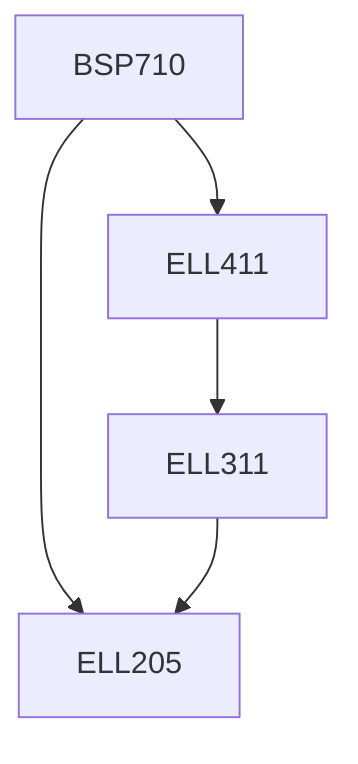

**Credits:** 3 (0-1-4)

**Prerequisites:** [[/Electrical Engineering/ELL205|ELL205]], [[/Electrical Engineering/ELL411|ELL411]]

#### Description
Signal processing tools – Keil for ARM processor, Code Composer Studio (CCS), Field Programme Gate Array (FGPA) processor; Pulse shaping and inter-symbol interference, digital filtering; design of ADC, DAC, PLL; receiver design; design of encoder and decoders: Convolution, Viterbi. Group-based term projects such as advanced coding schemes (LDPC, Turbo, RS, Polar, etc.) in conjunction with Demapper using Soft-decision/Hard-decision principles building a complete end to end system: design of band-pass processors for cell phone application, sample implementation of OFDM waveform TX and RX – like Wifi-6 o LTE. Sample implementation of single carrier waveform (DVB-S2. Cable/QAM, Doesis) both for RX and TX, design of audio codec, design of rake receiver- all could be implemented on FPGA or DSP such as ARM processor.

### Prerequisite Tree

