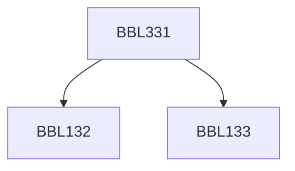

**Credits:** 3 (3-0-0)

**Prerequisites:** [[/Biochemical Engineering and Biotechnology/BBL132|BBL132]], [[/Biochemical Engineering and Biotechnology/BBL133|BBL133]]

#### Description
Microbial growth, substrate utilisation, and product formation kinetics; simple structured models; batch, fed-batch, repeated fed-batch, CSTR, CSTR with recycle, multistage CSTRs, and PFR; aeration and agitation; rheology of fermentation fluids; mixing and scale-up; air sterilization; media sterilization; design of fermentation media; aseptic transfer.

### Prerequisite Tree

