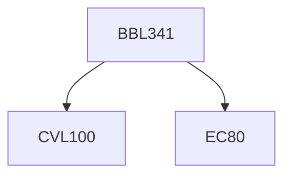

**Credits:** 3 (3-0-0)

**Prerequisites:** [[/Civil Engineering/CVL100|CVL100]] and EC 80

#### Description
Principles and concepts of ecosystem; Energy transfer in an ecosystem; Nutrient cycling; Basics of Environmental Microbiology, Environmental health: Ecotoxicology – Heavy metals, pesticides and their effects, Indices of toxicity, Measurement of pollution (techniques and instrumentation), Dose–response relationship. Microbial biosensors in environmental monitoring, Environmental technologies: Microorganisms and renewable sources of energy, Biodegradation and bioremediation (phyto and microbial), Energy and nutrient recovery during waste treatment, Risk assessment: Life cycle analysis, Molecular tools in Environmental Biotechnology, Role of biotechnology in environmental protection.

### Prerequisite Tree

