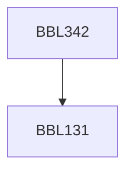

**Credits:** 3 (2-1-0)

**Prerequisites:** [[/Biochemical Engineering and Biotechnology/BBL131|BBL131]]

#### Description
Characteristic features of Biological system, Structure-function relationships. Characterization of biomolecules by molecular shape, size and molecular weight. Properties of biomolecules in solution: Diffusion, ultra-centrifugation and electrophoresis. Optical properties of biomolecules; Spectroscopic methods: IR, NMR, Optical rotary and circular dichroism & imaging methods: Bright, darkfiled and fluorescence imaging.

### Prerequisite Tree

