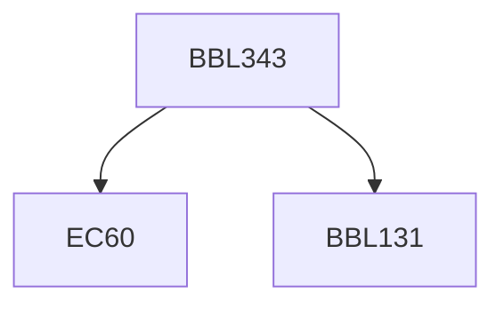

**Credits:** 3 (2-1-0)

**Prerequisites:** [[/Biochemical Engineering and Biotechnology/BBL131|BBL131]] and EC 60

#### Description
Introduction, Molecular structure of polysaccharides, Enzymes degrading polysaccharides, Physical properties of polysaccharides, Production of microbial Polysaccharides, Food usage of exopolysaccharides, Industrial Usage of exopolysaccharides, Medical applications of exopolysaccharides Molecular structure of lipids, Physical properties of lipids, Oleaginous microorganisms and their principal lipids, Production of microbial lipids, Modification of lipids for commercial applications, Extracellular microbial lipids and biosurfactants, Micelles and reverse micelles in biology, Liposomes in drug delivery.

### Prerequisite Tree

