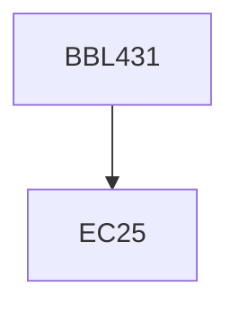

**Credits:** 2 (2-0-0)

**Prerequisites:** EC25

#### Description
Chemical vs biochemical processing; Substrates for bioconversion processes; Process technology for production of primary and secondary metabolites such as ethanol, lactic acid, citric acid, amino acids, biopolymers, industrial enzymes, penicillin, recombinant glutathione and insulin.

### Prerequisite Tree

