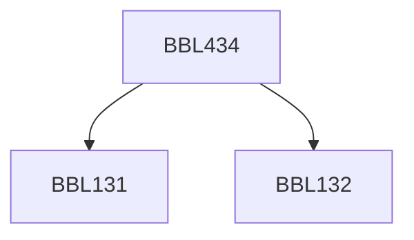

**Credits:** 3 (2-0-2)

**Prerequisites:** [[/Biochemical Engineering and Biotechnology/BBL131|BBL131]], [[/Biochemical Engineering and Biotechnology/BBL132|BBL132]]

#### Description
The topics include introduction to bioinformatics - resources and applications, Biological sequence analysis, sequence alignment, molecular phylogenetic analysis, genome organization and analysis, protein analysis, molecular modeling and drug design.

### Prerequisite Tree

