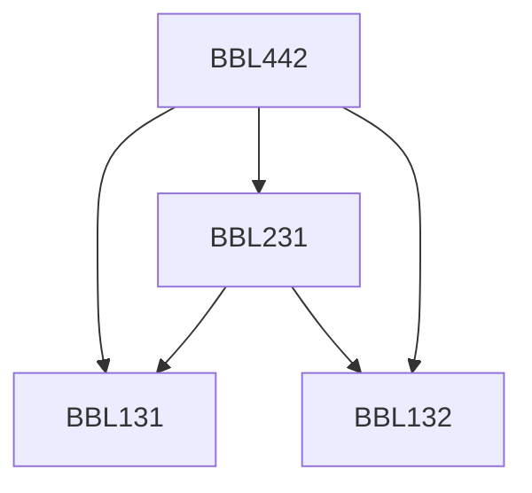

**Credits:** 4 (3-0-2)

**Prerequisites:** [[/Biochemical Engineering and Biotechnology/BBL131|BBL131]], [[/Biochemical Engineering and Biotechnology/BBL132|BBL132]], [[/Biochemical Engineering and Biotechnology/BBL231|BBL231]]

#### Description
Historical background, Innate and acquired immunity. Cells and organs of immune system. Molecules of immune system – immunoglobulins, MHCs, Cytokines, T cell receptors. Generation of antibody and T cell receptor diversity. Complement system. Humoral and Cell mediated immunity. Immune regulation. Vaccines. Hybridoma. Immunodeficiencies and AIDS. Transplantation immunity and cancer.

### Prerequisite Tree

