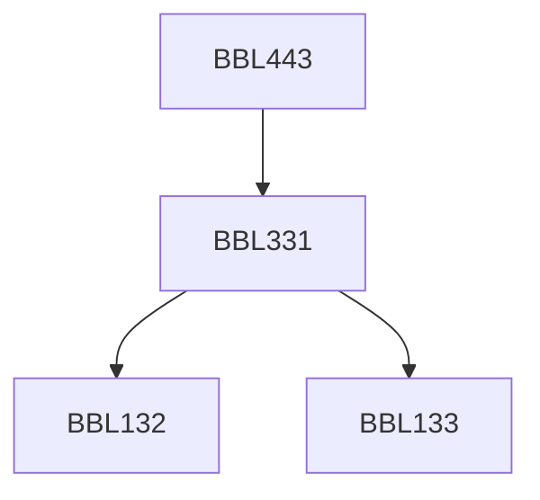

**Credits:** 4 (3-0-2)

**Prerequisites:** [[/Biochemical Engineering and Biotechnology/BBL331|BBL331]]

#### Description
Types of kinetic models, Data smoothing and analysis, Mathematical representation of Bioprocesses, Parameter estimation, Numerical Integration techniques, Parameter Sensitivity analysis, Statistical validity, Discrimination between two models. Case studies Physiological state markers and its use in the formulation of a structured model, Development of compartment and metabolic pathway models (Software Probe) for intracellular state estimation. Dynamic Simulation of batch, fed-batch steady and transient culture metabolism, Numerical Optimization of Bioprocesses using Mathematical models.

### Prerequisite Tree

