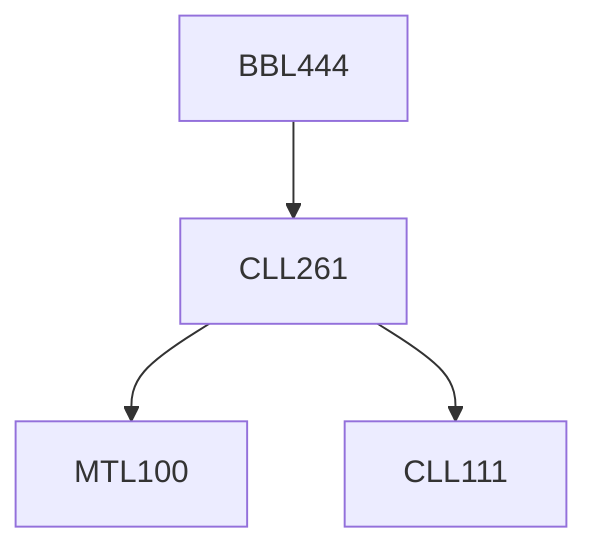

**Credits:** 3 (3-0-0)

**Prerequisites:** [[/Chemical Engineering/CLL261|CLL261]]

#### Description
The course begins with an overview of classical control theory leading to a detailed analysis of the stability of biological systems. Lyapunov stability is introduced followed by concepts of nonlinear control theory and applications to bioreactors. Control loops in metabolic and protein networks are discussed in the background evolution and motifs selected by natural systems. This leads to the introduction of large protein interaction networks and study of their architectures. Applications of these ideas in apriori analysis of synthetic circuits are examined. The course ends with case studies from the literature.

### Prerequisite Tree

