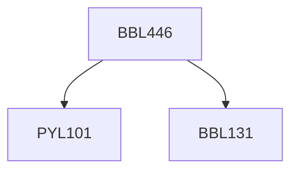

**Credits:** 3 (3-0-0)

**Prerequisites:** [[/Physics/PYL101|PYL101]], [[/Biochemical Engineering and Biotechnology/BBL131|BBL131]]

#### Description
Spectroscopic methods in biophysics, conformational changes in biological processes, biological energy conservation and transduction, photosynthesis, transport across biomembranes, the biophysics of motility, the biophysics of the nerve impulse, single molecule biophysical studies.

### Prerequisite Tree

